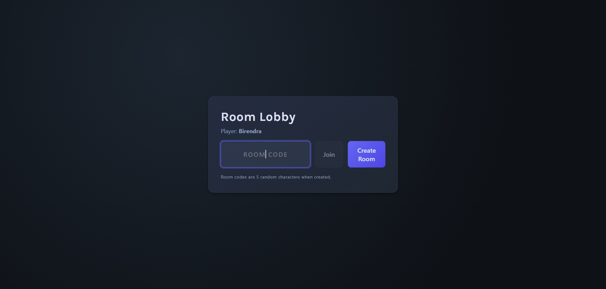
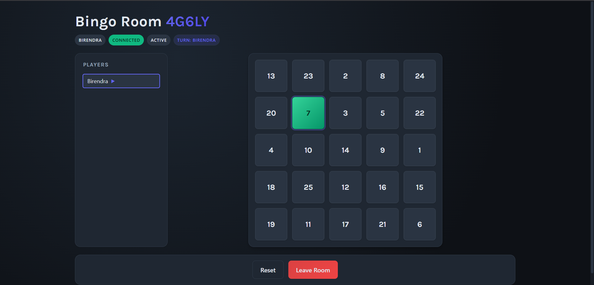

# Multiplayer Bingo (Rooms + WebSockets)

Full‑stack Bingo with real‑time rooms, turn enforcement, and a modern UI.

- Frontend: React + Vite (room lobby, responsive board, status panels)
- Backend: FastAPI + WebSockets (per-room state, turns, multi-winner draw)

## Live Demo

- Frontend (Vercel): https://bingo-three-lilac.vercel.app/
- Backend Health (Render): https://bingo-uy9e.onrender.com/

> Note: For production, configure the frontend build with HTTPS/WSS endpoints (see Deployment).

---

## Screenshots / Demo

> Place your screenshots under `docs/demo/` in this repo. Currently showing the two available images.

### Lobby – Create or Join a Room


### In-Game – Turn Indicator and Player List


---

## Features

- Create/join a room via a 5‑character code (e.g., `AB123`).
- Per-room state: players, numbers drawn, turn order, and phase.
- Real‑time sync via WebSockets (`/ws/{room_id}`) with reconnect/backoff.
- REST endpoints for room creation and state fetch on reconnect.
- Turn‑based play: only the active player can mark the next number.
- Deterministic boards (seeded by room + player name) for fairness/recovery.
- Multi‑winner draw support: if multiple clients claim winner at the same time, it’s announced as a draw.
- Modern, responsive UI with accessible focus styles and animations.

> Default win rule is “5 completed lines” (rows/columns/diagonals). You can adjust this in the client.

---

## Gameplay Notes

- Lines counted: 5 rows, 5 columns, and 2 diagonals (main and anti-diagonal).
- Current client rule: a player wins when they have 5 or more completed lines.
- The server accepts winner claims and will mark a draw if more than one distinct player declares at the same time.

---

## Backend (FastAPI)

File: `backend/bingo_ws_server.py`

Room structure (in memory):
```python
rooms = {
	room_id: {
		"players": { websocket: player_name },
		"player_names": { player_name: websocket },
		"numbers_drawn": set(),
		"winner": None | str,      # first winner (legacy)
		"winners": list[str],      # multi-winner (draw) support
		"turn_order": list[str],
		"turn_index": int,
		"phase": "waiting" | "active" | "finished",
	}
}
```

WebSocket messages (per room):

| Type | Direction | Payload | Description |
|------|-----------|---------|-------------|
| `join` | client→server | `{ name }` | Registers player, returns state |
| `state` | server→client | full snapshot | Sent to newly joined client |
| `player_joined` | server→room | `{ player, players, turn_order, current_player, phase }` | New player broadcast |
| `player_left` | server→room | `{ player, players, turn_order, current_player, phase }` | Player left broadcast |
| `mark_number` | both | `{ number, marked_by }` | Number marked (server enforces turn and dedup) |
| `next_turn` | server→room | `{ current_player, turn_order }` | Announces whose turn is next |
| `invalid_move` | server→client | `{ reason, current_player }` | Out-of-turn or duplicate number |
| `winner` | server→room | `{ winner, winners, draw, phase }` | Single or multi‑winner (draw) announcement |
| `reset` | server→room | `{ turn_order, current_player, phase }` | Clears numbers/winners and resets turn index |
| `heartbeat` / `heartbeat_ack` | optional | – | Keep‑alive |

REST endpoints:

- `POST /rooms` → `{ "room_id": "ABCDE" }`
- `GET /state/{room_id}` → `{ room_id, players, numbers_drawn, winner, winners }`

> Note: State is in memory. For production scale/high availability use a shared store (e.g., Redis) and proper room lifecycle.

---

## Frontend

Primary component: `frontend/src/RoomMultiplayerBingo.jsx`.

Environment variables (see `frontend/.env.example`):
```
VITE_API_URL=http://localhost:8000
VITE_WS_URL_BASE=ws://localhost:8000/ws
```
At runtime, the WebSocket URL becomes `${VITE_WS_URL_BASE}/${roomId}`.

Production tips:
- If serving frontend over HTTPS, your API must be HTTPS and WS must be WSS.
- On Vercel/Netlify, set `VITE_API_URL=https://<your-api>` and `VITE_WS_URL_BASE=wss://<your-api>/ws` before building.
- The app includes heuristics to auto‑derive endpoints, but explicit env vars are recommended.

---

## Local Development

### 1) Backend
```bash
cd backend
python -m venv .venv
source .venv/bin/activate  # Windows: .venv\Scripts\activate
pip install -r requirements.txt
uvicorn bingo_ws_server:app --reload --host 0.0.0.0 --port 8000
```

### 2) Frontend
```bash
cd frontend
cp .env.example .env   # adjust if needed
npm install
npm run dev
```

Open the Vite URL (usually `http://localhost:5173`).

### 3) Play
1. Enter a name.
2. Create a room (share the code) or join an existing one.
3. Click numbers when it’s your turn; the first to complete 5 lines wins (draws are supported if declared simultaneously).
4. Reset to start a new game in the same room.

---

## Deployment

### Backend Options
1. Docker (recommended) – provide a container exposing port 8000.
2. Render / Railway / Fly.io – run a `uvicorn` web service (WebSockets enabled).
3. Azure / AWS / GCP – use containers or managed app services.

Minimal `Dockerfile`:
```Dockerfile
FROM python:3.11-slim
WORKDIR /app
COPY backend/requirements.txt .
RUN pip install --no-cache-dir -r requirements.txt
COPY backend/ .
EXPOSE 8000
CMD ["uvicorn", "bingo_ws_server:app", "--host", "0.0.0.0", "--port", "8000"]
```

### Frontend
1. `npm run build` (outputs to `dist/`).
2. Host the static bundle (Vercel, Netlify, S3+CloudFront, etc.).
3. Set env vars before build:
	 - `VITE_API_URL=https://your-backend`
	 - `VITE_WS_URL_BASE=wss://your-backend/ws`

If reverse proxying under one domain (recommended), ensure:
- CORS allows your frontend origin (or be explicit with allowed origins).
- WebSockets are upgraded (see Nginx snippet below).

### Reverse Proxy (Nginx) Snippet
```nginx
location /ws/ {
	proxy_pass http://backend:8000/ws/;
	proxy_http_version 1.1;
	proxy_set_header Upgrade $http_upgrade;
	proxy_set_header Connection "upgrade";
	proxy_set_header Host $host;
}
location /state/ { proxy_pass http://backend:8000/state/; }
location /rooms { proxy_pass http://backend:8000/rooms; }
```

---

## Styling & Theming

The UI uses CSS variables for colors, radii, and shadows; supports responsive grids and accessible focus styles. Customize via `frontend/src/index.css`.

---

## Troubleshooting

| Issue | Check |
|------|-------|
| Create room fails with “Failed to fetch” | Ensure `VITE_API_URL` is HTTPS in production; avoid mixed content (HTTPS page → HTTP API). |
| WebSocket fails | Use `wss://` in production; confirm proxy upgrades WS; CORS/Origin headers. |
| State not syncing | `GET /state/{room}` returns 200? Check backend logs. |
| Room not found | Rooms are in-memory and deleted when empty; create a new one. |

---

Enjoy playing Multiplayer Bingo! 🎉
